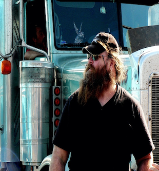
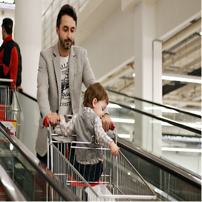

# Test Concept 

## Sections
- [INTRODUCTION](#introduction)
- [HOW TO USE THIS DOCUMENT](#how-to-use-this-document)
- [CHALLENGES FOR THE TEST PLAN
](#challenges-for-the-test-plan)
- [TESTING LEVELS](#testing-levels)
- [TEST ITEMS / ARTIFACTS](#test-items-/-artifacts)
- [NON-TEST ITEMS EXCLUDED FROM SCOPE](#non-test-items-excluded-from-scope)
- [SUPPORTED ENVIRONMENTS FOR TESTING](#supported-environments-for-testing)
- [VERSIONING FOR THE NUTRISAFE COMPONENTS AND SYSTEM](#versioning-for-the-nutrisafe-components-and-system)
- [EXPLICITLY UNSUPPORTED ENVIRONMENTS](#explicitly-unsupported-environments)
- [TEST SCENARIOS](#test-scenarios)
     - [SCENARIO SOFT CHEESE](#scenario-soft-cheese)
     - [PERSONAS](#personas)
- [RISKS AND MITIGATION](#risks-and-mitigation)
[TEST DELIVERABLES](#test-deliverables)
- [DETAILED TEST LIST](#detailed-test-list)
     - [SYSTEM UNDER TEST = NUTRISAFE DEPLOYMENT SCRIPTS](#system-under-test-=-nutrisafe-deployment-scripts)
     - [SYSTEM UNDER TEST = DEMO SCRIPT](#system-under-test-=-demo-script)
     - [SYSTEM UNDER TEST = NUTRISAFE IMAGES (DOCKER)](#system-under-test-=-nutrisafe-images-(docker))
- [RECOMMENDATIONS](#recommendations)
- [METHODOLOGY OF THIS DOCUMENT + REFERENCES](#methodology-of-this-document-+-references)

&nbsp;
&nbsp;

## INTRODUCTION

The NutriSafe Toolkit is meant to offer several software artifacts as well as guidance to practitioners in the industry. While we strive to make the software as easy to use as possible, a certain amount of complexity remains. In order to better understand how the product works and later how to extend it, one also needs to know how it should be tested. In this document we will be documenting our principles and scenarios for testing, as well as test strategies and tools employed. We based the structure of this document on the existing ISO/IEC/IEEE norm (ISO/IEC 2013) and it is loosely comparable to the Test Plan but also include Test Policy aspects.

&nbsp;
 &nbsp;

## HOW TO USE THIS DOCUMENT

Please review and update this document at least once per release (or iteration if you are using agile methods). The document should have a specified release correspondence and cannot be assumed to be valid for newer iterations or versions.

&nbsp;
 &nbsp;

## CHALLENGES FOR THE TEST PLAN

1. Blockchain technology in general and Hyperledger Fabric in particular are still complex. One cannot assume that even trained IT specialists and practitioners are familiar with it.

2. Multiple “moving parts” (code, scripts, APIs etc.) make it difficult to create a uniform plan.

3. No “customer” but a set of requirements and scenarios.

&nbsp;
 &nbsp;

## TESTING LEVELS

This chapter describes which test levels will be used within this document. Typical testing levels (as mentioned by  (Copeland 2004)) are (in order from small to large) unit testing, integration testing, system testing and acceptance testing. A test strategy e.g. black box testing involves going through the levels and evaluating the appropriate component at the appropriate abstraction level.
The levels used by this document:
-	Unit tests
-	Integration tests
-	Security tests
-	Usability tests
The levels not used, but recommended for end-users:
-	Acceptance tests
-	Performance tests
Not all components use all levels of testing. Thus, it is possible for e.g. the Production Dashboard to have unit tests, integration tests and usability tests, however the network setup scripts only need a special case of usability tests. 

&nbsp;
 &nbsp;

## TEST ITEMS / ARTIFACTS

The NutriSafe artifacts to be tested are as follows:

1.  NutriSafe deployment scripts (network)
     
	 a.Runnable on target environments for the scenarios Track and Trace, Cheese, Coffee (?)

     b.For each relevant script: existence of documentation for IT users

2.	DEMO script

     a.Generation of random data for scenario Cheese
	   
     b.Generation of data for scripted scenario

     c.Existence of documentation for IT users
3.	NutriSafe images (docker)

     a.Deployment on target environments (image runs and does not exit)

     b.For each image: existence of documentation for IT users.

4.	NutriSafe chaincode

     a.Unit tests (partially provided by partners)

     b.Existence of documentation for IT users (installation using script)

5.	NutriSafe Dashboard
     
	  a.Unit test framework

      b.Some unit tests - automated

      c.Integration tests (REST API,  Chaincode) - automated

      d .User Interface tests (manual, checklist)

6.	All components

	  a.Performance or load testing recommendations / guidelines (no actual scripts or tests)

      b.Security and penetration testing recommendations / guidelines (no actual script or tests)

      c.System test – scenario-based

      d.Simulation as a test for scenario validity.

      e.Serious games as a test for the security concept and awareness of risks and attack vectors.

      &nbsp;
      &nbsp;

## NON-TEST ITEMS EXCLUDED FROM SCOPE

These elements are specifically NOT included here and will not be performed because of limitations in the current research project. Users of the code can modify this scope as they see fit.
1.	NutriSafe REST API (limited, some tests already in place)

2.	NutriSafe chaincode

    a. Integration tests with other chaincodes

    b. Regression testing 

    c. Performance testing
	  
    d.External chaincode (introduced in V2.x, but not covered by our products)

3.	NutriSafe Dashboard
    a. Performance testing
    b. Regression testing

4.	All components

    a. Security and penetration testing – this is not feasible to do in the project lifetime, only guidelines will be provided.

    b. Acceptance testing – as we do not have a concrete customer in a research project, this should be done by users of the code according to their own needs.

    c. Database testing (relevant for REST API)

    &nbsp;
 &nbsp;

## SUPPORTED ENVIRONMENTS FOR TESTING

Linux OS (Ubuntu): 18, 20

RAM: Minimum 8 GB 

CPU: at least 2

Required storage: Minimum 15 GB

Docker Versions: 17.06.2-ce or greater

Hyperledger Fabric versions: 1.4, 2.2.1 (Long Term Support)

For Webapplications: Browser – Chrome, Firefox

&nbsp;
&nbsp;

# VERSIONING FOR THE NUTRISAFE COMPONENTS AND SYSTEM

Regarding versioning there are a few details to be documented here. The NutriSafe-Ecosystem uses semantic versioning  as the basic

&nbsp;
 &nbsp;

## EXPLICITLY UNSUPPORTED ENVIRONMENTS

We do not currently support Kubernetes rollouts, although the scenario is clearly supported by Hyperledger Fabric itself. 

MacOS may also be used. Our own internal tests have shown that deployment is possible on Docker for macOS. This should hold for Windows-based installations but we have not tested this.

&nbsp;
 &nbsp;

## TEST SCENARIOS

The actual NutriSafe scenarios are described in the Toolkit. Of these we include the following scenarios for our testing:

1.	Soft Cheese (Track and Trace)
2.	Logistics (Efficient information sharing/collaboration)
3.	Custom / Network only

&nbsp;
 &nbsp;

### SCENARIO SOFT CHEESE

 
&nbsp;
&nbsp;

### PERSONAS

In order to determine which target roles and people are considered when designing the system we need a sketch of their typical skills, company function etc. A good description of how and why we use personas can be found at (Pruitt and Adlin 2006)

|Dinah|Decision Maker (Producer)|
|:--------:|:---------:|
||Takes appropriate decisions based on the data available on the Dashboard.Needs basic understanding of the web technology and blockchain.Basic training for the product required.

 &nbsp;
 &nbsp;

|Pauline|Production Manager|
:--------:|:---------:|
||Takes action on the available data to ensure data correctness. For example, if the milk delivery of 60 liters was made but incorrectly entry of 50 liters was done in the system, this data can be corrected.Needs basic understanding of the web technology and blockchain. Basic training for the product required.

  &nbsp;
 &nbsp;

|Darren|Disposition and Services|
:--------:|:---------:|
 ||Places orders in the system on behalf of the retailer/intermediate body for production/delivery of the goods from the producer.Needs basic understanding of the web technology and blockchain. Basic training for the product required.

 &nbsp;
 &nbsp;

|Izzy|IT Administrator|
:--------:|:---------:|
||Responsible for setting up and maintaining the infrastructure. The administrator ensures that internal IT structure of the organization remains up-to-date. Should have at least vocational computer education along with understanding of the web technology and blockchain.

 &nbsp;
 &nbsp;

|Neele|Network Manager|
:--------:|:---------:| 
||Responsible for overseeing and managing supply chain along with ensuring operation efficiently for greater productivity.Needs basic understanding of the web technology and blockchain.

 &nbsp;
 &nbsp;

|Nathan|Network Support| 
:--------:|:---------:|
||Responsible for supporting and handling organizational network, handling tickets and offering first level support.Example, for a small producer, setting up the network.The network support personnel should have in-depth knowledge of computer newtork, basic understanding of the network traffic involved in blockchain-networks and how they are structured at component level

 &nbsp;
 &nbsp;

|Darlene|Developer|
|:--------:|:---------:|
||The developers are responsible to write new smart contracts or change/update/fix the existing chain code.The developer should have a bachelor degree in computer science with strong background in software and backend development

 &nbsp;
 &nbsp;

|Quinn|Quality Manager|
|:--------:|:---------:|
||Input completed production quantity into the system. Updates system to Raise quality issues or alerts in the system.Needs basic understanding of the web technology and blockchain.

 &nbsp;
 &nbsp;

|Don|Driver|
:--------:|:---------:| 
||Responsible for acknowledging the delivery of the goods in the system.Needs basic computer knowledge and training to use the application.

 &nbsp;
 &nbsp;

|Wilhelm|Warehouse Manager|
:--------:|:---------:|
||Responsible for acknowledging the receipt of the goods in the system.Needs basic computer knowledge and training to use the application.

 &nbsp;
 &nbsp;

|Warda|Wholesaler/Distributors/Retailer/Logistic|
:--------:|:---------:|
||They are responsible for updating the system and storing the information of the inventory received and distributed from producer to retailer to customer. Raise quality issues/complain in the system.A basic understanding of technology usage is sufficient and training to use the application.

 &nbsp;
 &nbsp;

|Chris|Customer| 
:--------:|:---------:|
||Raise quality issues/complain in the system.A basic understanding of technology usage is sufficient.

&nbsp;
&nbsp;

## RISKS AND MITIGATION

Risks are listed here.

|   Risk   |    Migitation|
|:----------|:-------------|
|Container-Hosts behavior might differ when used on similar operating systems e.g. DebIzzy, RedHat, Windows, macOS|Reduce supported scope on the broadest available and stable technology.

&nbsp;
&nbsp;

## TEST DELIVERABLES
1.	Test artifacts for automated test
2.	Templates for manual or semi-manual tests

&nbsp;
&nbsp;
	

## DETAILED TEST LIST 

In the table below one can find a detailed list of which tests should be run on which functionality.

Run type = either Manual, partly automated (e.g. scripted, but the script should be triggered manually), fully automated (e.g. part of the build/deploy pipeline).

&nbsp;
&nbsp;

### SYSTEM UNDER TEST = NUTRISAFE DEPLOYMENT SCRIPTS

|Header|Details|
|:-----|:-------|
**Tested item/functionality**|startNetwork.sh
**Test level**|Integration
**Hyperledger** Version|1.4
**Platform (OS)**|macOS
**Test description**|Run command in “./startNetwork.sh” in cmd
**Persona**|Izzy/IT-Administrator
**Pre-conditions**|Docker, jq, golang, Hyperledger fabric sample should be installed
**Post-conditions**|The command should start executing
**Expected result**|Network should be running

&nbsp;
&nbsp;

|Header|Details|
|:-----|:-------|
**Tested item/functionality**|startNetwork.sh
**Test level**|Integration
**Hyperledger Version**|2.2
**Platform (OS)**|macOS
**Test description**|Run command in “./startNetwork.sh” in cmd
**Persona**|Izzy/IT-Administrator
**Pre-conditions**|Docker, jq, golang, Hyperledger fabric sample should be installed
**Post-conditions**|The command should start executing
**Expected result**|Network should be running

&nbsp;
&nbsp;

|Header|Details|
|:-----|:-------|
**Tested item/functionality**|startNetwork.sh
**Test level**|Integration
**Hyperledger Version**|1.4
**Platform (OS)**|Linux Ubuntu 20.04
**Test description**|Run command in “./startNetwork.sh” in cmd
**Persona**|Izzy/IT-Administrator
**Pre-conditions**|Docker, jq, golang, Hyperledger fabric sample should be installed
**Post-conditions**|The command should start executing
**Expected result**|Network should be running

&nbsp;
&nbsp;

|Header|Details|
|:-----|:-------|
**Tested item/functionality**|startNetwork.sh
**Test level**|Integration
**Hyperledger Version**|2.2
**Platform (OS)**|Linux Ubuntu 20.04
**Test description**|Run command in “./startNetwork.sh” in cmd
**Persona**|Izzy/IT-Administrator
**Pre-conditions**|Docker, jq, golang, Hyperledger fabric sample should be installed
**Post-conditions**|The command should start executing
**Expected result**|Network should be running

&nbsp;
&nbsp;

|Header|Details|
|:-----|:-------|
**Tested item/functionality**|removeNetwork.sh
**Test level**|Integration
**Hyperledger Version**|1.4
**Platform (OS)**|macOS
**Test description**|Run Command in “./removeNetwork.sh” in cmd
**Persona**|Izzy/IT-Administrator
**Pre-conditions**|Network should be set up
**Post-conditions**|The command should start executing
**Expected result**|Network should be stopped

&nbsp;
&nbsp;

|Header|Details|
|:-----|:-------|
**Tested item/functionality**|removeNetwork.sh
**Test level**|Integration
**Hyperledger Version**|2.2
**Platform (OS)**|macOS
**Test description**|Run Command in “./removeNetwork.sh” in cmd
**Persona**|Izzy/IT-Administrator
**Pre-conditions**|Network should be set up
**Post-conditions**|The command should start executing
**Expected result**|Network should be stopped

&nbsp;
&nbsp;

|Header|Details|
|:-----|:-------|
**Tested item/functionality**|removeNetwork.sh
**Test level**|Integration
**Hyperledger Version**|1.4
**Platform (OS)**|Linux Ubuntu 20.04
**Test description**|Run Command in “./removeNetwork.sh” in cmd
**Persona**|Izzy/IT-Administrator
**Pre-conditions**|Network should be set up
**Post-conditions**|The command should start executing
**Expected result**|Network should be stopped

&nbsp;
&nbsp;

|Header|Details|
|:-----|:-------|
**Tested item**/functionality|removeNetwork.sh
**Test level**|Integration
**Hyperledger Version**|2.2
**Platform (OS)**|Linux Ubuntu 20.04
**Test description**|Run Command in “./removeNetwork.sh” in cmd
**Persona**|Izzy/IT-Administrator
**Pre-conditions**|Network should be set up
**Post-conditions**|The command should start executing
**Expected result**|Network should be stopped

&nbsp;
&nbsp;

|Header|Details|
|:-----|:-------|
**Tested item/functionality**|installCC.sh (Installs Chaincode on the Network)
**Test level**|Integration
**Test description**|Attempt to install and deploy java or go chaincode packages on the NutriSafe network. 
**Persona**|Izzy/IT-Administrator
**Pre-conditions**|Network is set up and running via startNetwork.sh. User has downloaded chaincode or created it in the chaincode subdirectory. Chaincode is compatible with current network versions.
**Post-conditions**|The command should start executing
**Expected result**|Nutrisafe-chaincode (if not otherwise specified in the parameters) is installed. Additional container is created in Docker – can check with docker ps).

&nbsp;
&nbsp;

### SYSTEM UNDER TEST = DEMO SCRIPT
Tbd
Tested item/functionality	
Test level	
Test description	
Persona	
Pre-conditions	
Post-conditions	
Expected result	

Tested item/functionality	Demodata/generate_demodata.py
Test level	Integration
Test description	Option 2: Generate random products according to pre-defined JSON configuration files.
Persona	Izzy/IT-Administrator
Pre-conditions	Python at least 2.7. Recommended Python 3.
Post-conditions	
Expected result	

Tested item/functionality	Demodata/generate_demodata.py
Test level	Integration
Test description	Option 1: Generate basic data structures.
Persona	Izzy/IT-Administrator
Pre-conditions	Python at least 2.7. Recommended Python 3.
Post-conditions	
Expected result	

Tested item/functionality	Demodata/generate_demodata.py
Test level	Integration
Test description	Option 3: Generate random products according to pre-defined JSON configuration files.
Persona	Izzy/IT-Administrator
Pre-conditions	Python at least 2.7. Recommended Python 3.
Post-conditions	
Expected result

&nbsp;
&nbsp;

### SYSTEM UNDER TEST = NUTRISAFE IMAGES (DOCKER)
Tbd
Tested item/functionality	
Test level	
Test description	
Persona	
Pre-conditions	
Post-conditions	
Expected result	

&nbsp;
&nbsp;

## RECOMMENDATIONS

In this section we provide recommendations for topics which cannot otherwise be specifically treated as we are building our Toolkit but would normally be treated in a test concept.
SKILL PROFILE FOR TESTERS
tbd

&nbsp;
&nbsp;

## METHODOLOGY OF THIS DOCUMENT + REFERENCES

Copeland, Lee. 2004. A Practitioner’s Guide to Software Test Design. Boston: STQE Publishing. 
ISO/IEC. 2013. “ISO/IEC/IEEE 29119-3:2013, Part 3: Test Documentation.” ISO/IEC.
Pruitt, John, and Tamara Adlin. 2006. The Persona Lifecycle: Keeping People in Mind Throughout Product Design. San Francisco: Morgan Kaufman.

