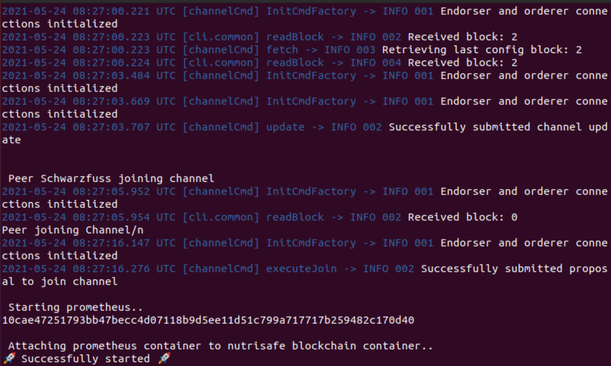
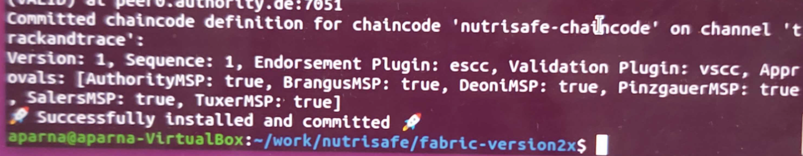
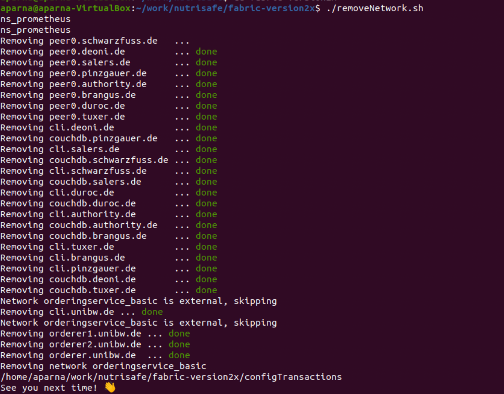
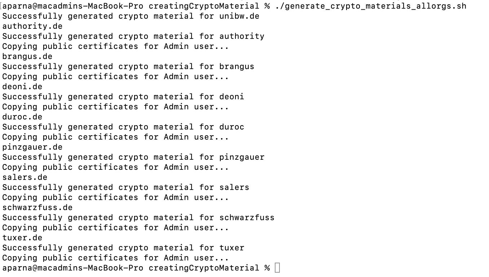
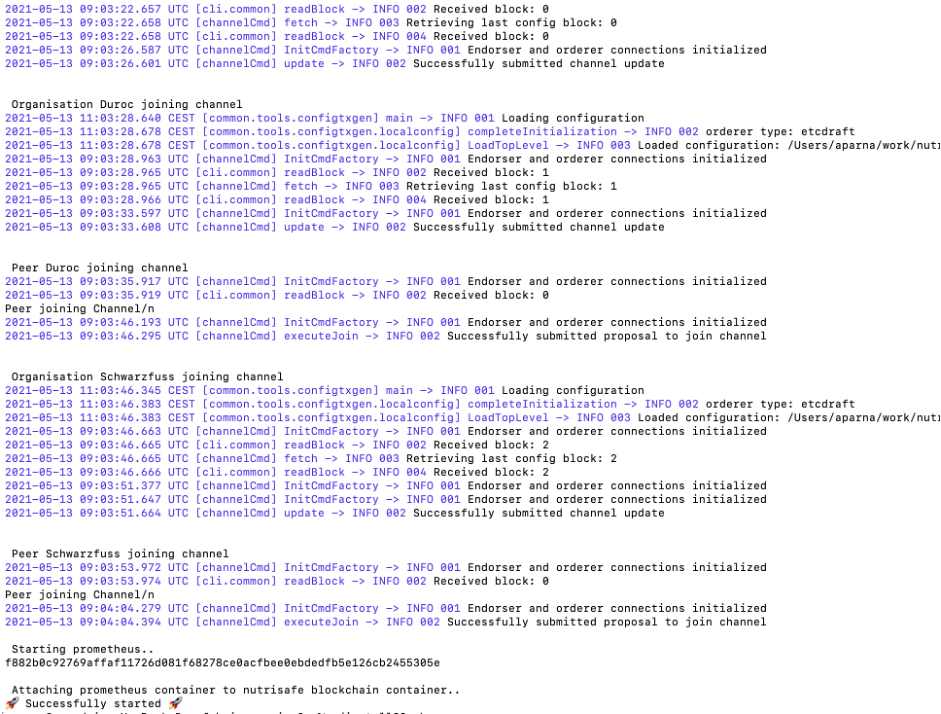
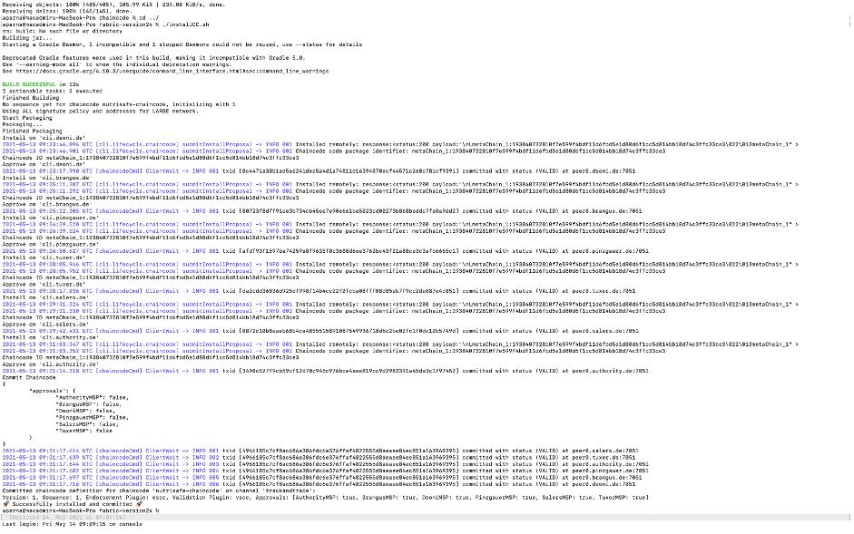
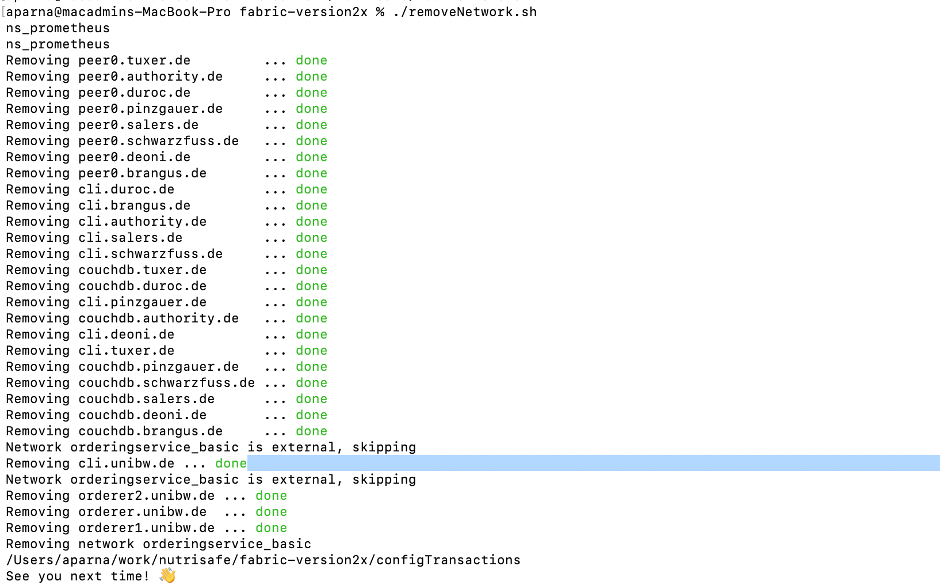

# General Information

This repository contains the scripts for deploying a Hyperledger Fabric Network. It has scripts for: 
- creating a ordering service (one ordering node, modus: solo)
- creating a consortium 
- creating a channel
- creating a node
- joining a channel


Note that this basic configuration uses pre-generated certificates and
key material, and also has predefined transactions to initialize a 
channel named "mychannel".

<a rel="license" href="http://creativecommons.org/licenses/by/4.0/"></a><br />This work is licensed under a <a rel="license" href="http://creativecommons.org/licenses/by/4.0/">Creative Commons Attribution 4.0 International License</a>


# Development
## Environment Linux
We used an UBUNTU 20.04 Server instance.

After setting up the server, the connections and the development environment, we started to install the necessary tools for a running Hyperledger Fabric network (see <a href="https://hyperledger-fabric.readthedocs.io/en/release-1.4/prereqs.html">HL Fabric Docs</a>).
  
Minimum hardware requirements:

- 2 vCPUs
- 8 GB RAM
- Use Disk/Partition should have at least 15 GB free space (at least for the standard scenario)

## Prerequisites

### Update your system

```
sudo apt-get update
```

### Install

```
sudo apt-get install apt-transport-https ca-certificates curl gnupg-agent software-properties-common
```


### Installing Docker 
(see <a href="https://docs.docker.com/install/linux/docker-ce/ubuntu/#install-using-the-repository"> Docker Docs</a>).  Make sure the user account has the necessary rights to execute docker. 
```
curl -fsSL https://download.docker.com/linux/ubuntu/gpg | sudo apt-key add -

sudo apt-key fingerprint 9DC858229FC7DD38854AE2D88D81803C0EBFCD88

sudo add-apt-repository    "deb [arch=amd64] https://download.docker.com/linux/ubuntu \ $(lsb_release -cs) \ stable"

sudo apt-get install docker-ce docker-ce-cli containerd.io

sudo curl -L "https://github.com/docker/compose/releases/download/1.24.1/docker-compose-$(uname -s)-$(uname -m)" -o /usr/local/bin/docker-compose

sudo chmod +x /usr/local/bin/docker-compose

$ sudo usermod -aG docker <your-user>  
Error message = Got permission denied while trying to connect to the Docker daemon socket at ...
```
### Installing jq

```
sudo apt-get install jq
```

### Installing golang
Follow the instructions on <a href="https://github.com/golang/go/wiki/Ubuntu">golang</a>

```
sudo snap install go --classic
```

Set the environment variables for GO
```
$ export GOROOT=/usr/local/go
$ export GOPATH=/home/ubuntu/Dev/fabric-samples/
$ export PATH=$GOPATH/bin:$GOROOT/bin:$PATH
```

### Download hyperledger/fabric-samples and setup environment variables
```
curl -sSL http://bit.ly/2ysbOFE | bash -s 2.2.1
```
OR directly bootstrap to version 2.2

```
sudo curl -sSL https://raw.githubusercontent.com/hyperledger/fabric/release-2.2/scripts/bootstrap.sh | sudo bash -s -- -d
```

### Clone GIT Repository

### NutriSafe Network
1. Generate crypto materials (specify yaml config file. Default is pinzgauer.de)
```
cd <name_of_repository>/fabric-version2x/creatingCryptoMaterial
//e.g. for nutrisafe repository this will be "cd nutrisafe/fabric-version2x/creatingCryptoMaterial"
```
Run `generate_crypto_materials_allorgs.sh`
```
./generate_crypto_materials_allorgs.sh
```
On successful completion of the script, the final output should look like the below screenshot:


2. Start Network
```
./startNetwork.sh
```
On sucessful completion of the start script,the final output should look like the screenshot below:




3. Download chaincode (in this example we download the NutriSafe chaincode but you can also use your own chaincode here)
```
cd chaincode //switch to the chaincode subfolder 
git clone https://github.com/NutriSafe-DLT/nutrisafe-chaincode.git 
cd ..
./installCC.sh
```
If you are using your own repository then you need to pass the name to the installCC.sh script as follows:
./installCC.sh -c <my_chaincode_name>
This assumes that you have java chaincode. If you are using go chaincode you can also specifiy this:
./installCC.sh -c <my_chaincode_name> -n go

This is what it should look like if the script completes successfully:



4. In case you wish to remove the Network
```
./removeNetwork.sh
```
On successful removal of the network, the output should look like the below screenshot:



### Chaincode development
Install gcc compiler
```
apt-get install build-essential
```

### Helpful docker commands
Stop all docker containers
```
docker stop $(docker ps -a -q)
```
Remove all docker containers
```
docker rm $(docker ps -a -q)
```

###

1. Installing Docker
2. Installing Golang --> set Paths 
3. Cloning of the fabric-samples git repo
4. execute https://github.com/hyperledger/fabric/blob/release-2.2/scripts/bootstrap.sh

```
sudo curl -sSL https://raw.githubusercontent.com/hyperledger/fabric/release-2.2/scripts/bootstrap.sh | sudo bash -s -- -d
```

# Development MacOS

## Environment
Please note that this configuration has been tested with macOS 10.15 and 11.2 (Big Sur) it may also work with previous versions.

## Prerequisites
git is usually included with the Xcode SDK, so you may not need to install it explicitly if you have the SDK active. If you use brew as a package manager you probably already have this installed.

```
xcode-select --install
```

Docker can be obtained in the macOS-Version on the official website, please note that docker-composer will be installed automatically when installing docker.
[Here is the link to the docker website to download Docker Desktop](https://www.docker.com/get-started)

As a package manager we also recommend brew or ports. In this documentation we have tested with brew, so make sure you have this installed on your mac (you need _admin_ permissions to do this, so do not attempt to install with user permissions only).

### Prerequisite installation directly from the website (without Brew)

If you prefer to install jq directly from the product website please use [this URL](https://stedolan.github.io/jq/)

For the Golang package go to https://golang.org/doc/install#install and download the Mac package (admin rights needed for installation).


## OR Prerequisite Installation with Brew

To install brew you can go to [The Brew Website](https://brew.sh) or directly run:
```
/bin/bash -c "$(curl -fsSL https://raw.githubusercontent.com/Homebrew/install/HEAD/install.sh)"
```

After installing brew run this:

```
brew install jq
brew install golang
```

#### Install specific hyperledger fabric and ca version
```
curl -sSL https://bit.ly/2ysbOFE | bash -s -- <fabric_version> <fabric-ca_version>
```
Examples: 
- For Version 1.4 with the corresponding fabric-ca version. The -d parameter tells the script to skip the download of docker images and is quicker and saves you some disk space.

```
curl -sSL https://bit.ly/2ysbOFE | bash -s -- -d 1.4.6
```

- For Version 2.2 you may use the example below. The -d parameter tells the script to skip the download of docker images and is quicker and saves you some disk space.

```
curl -sSL https://bit.ly/2ysbOFE | bash -s -- -d 2.2.1
```
When newer builds are available e.g. 1.4.12 you may use this instead of the example above and it usually will work. If, however, the minor version number increases e.g. 2.3 instead of 2.2 it may be that you will experience some issues.

In order to run further scripts e.g. cryptogen etc. you need to add the fabric-samples/bin to the PATH environment variable.
```
export PATH=<path to download location>/bin:$PATH
```

## Clone NutriSafe GIT Repository


```
git clone <path_to_nutrisafe_repo>
```

## NutriSafe Network
1. Generate crypto materials (specify yaml config file. Default is pinzgauer.de)
```
cd <name_of_repository>/fabric-version1x/creatingCryptoMaterial
//e.g. for nutrisafe repository this will be "cd nutrisafe/fabric-version2x/creatingCryptoMaterial"
```
Run `generate_crypto_materials_allorgs.sh`
```
./generate_crypto_materials_allorgs.sh
```
On successful completion of the script, the final output should look like the below screenshot:



2. Start Network
```
cd .. //this will switch to the folder above (example from creatingCryptoMaterial to fabric-version1x)
./startNetwork.sh
```
On sucessful completion of the start script,the final output should look like the screenshot below:



3. Download chaincode (in this example we download the NutriSafe chaincode but you can also use your own chaincode here)
```
cd chaincode //switch to the chaincode subfolder 
git clone https://github.com/NutriSafe-DLT/nutrisafe-chaincode.git 
cd ..
./installCC.sh
```
If you are using your own repository then you need to pass the name to the installCC.sh script as follows:
./installCC.sh -c <my_chaincode_name>
This assumes that you have java chaincode. If you are using go chaincode you can also specifiy this:
./installCC.sh -c <my_chaincode_name> -n go

This is what it should look like if the script completes successfully:



4. In case you wish to remove the network use the below command:
```
./removeNetwork.sh
```

Once the script runs successfully, this is how the final output should look like:

